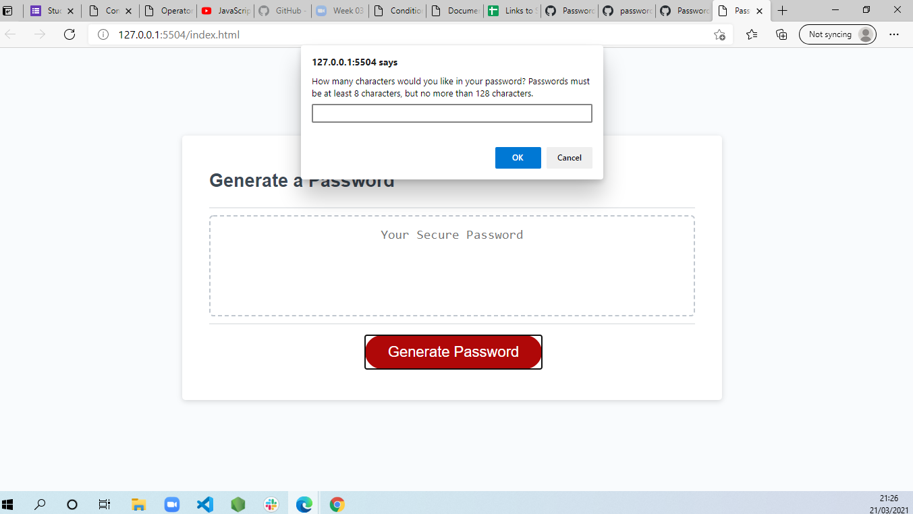
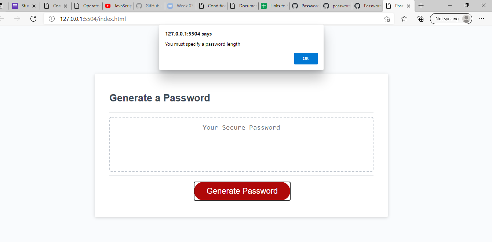
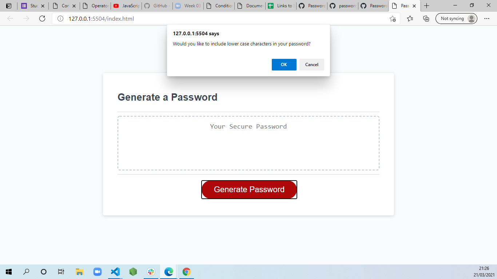
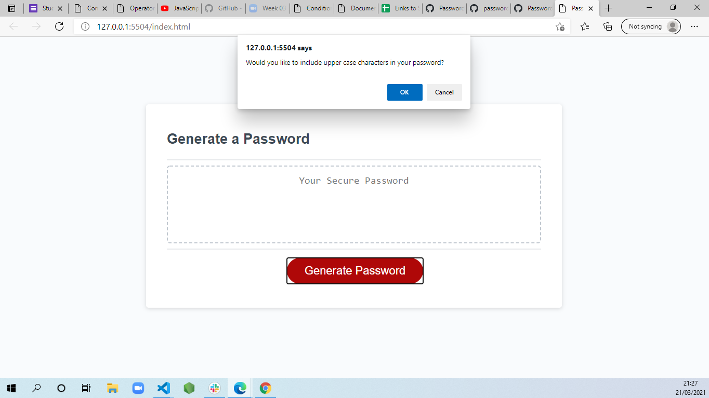
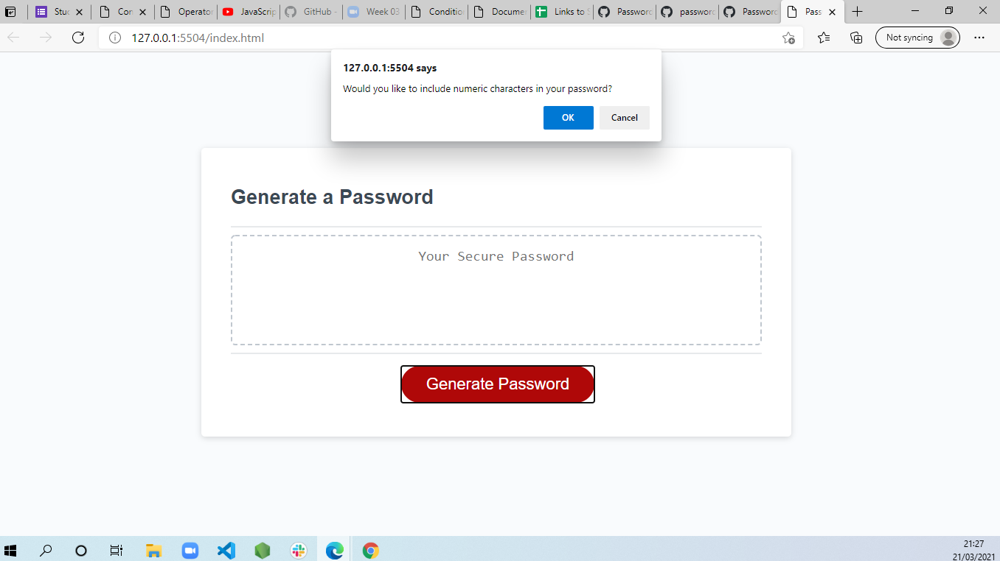

# Password Generator

i was asked to make the password generator and some of the code were given and i had to add javascript code to make it work according to the requirement.

The task was hard for me at the beginning because javascript is kind of language which is totaly different to html and css.the concept is not the hard to understand but apply that to code is a big task.

this is the last day to submit the assignment and i had to spend all my weekend just so i can submit by the end of today

## deployed URL

https://mrasheed1991.github.io/Password_generator/
